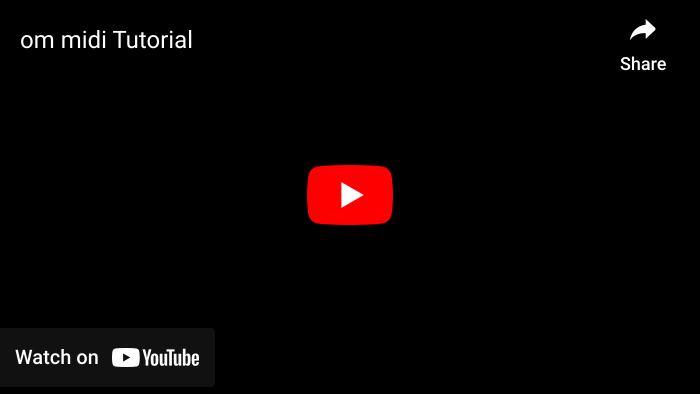
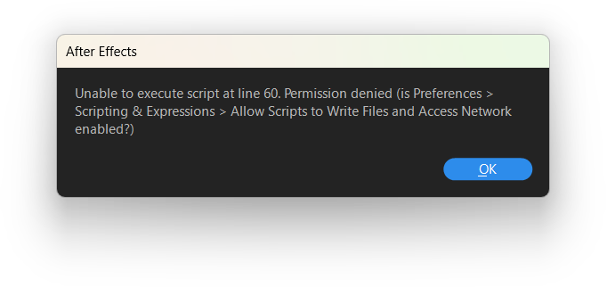
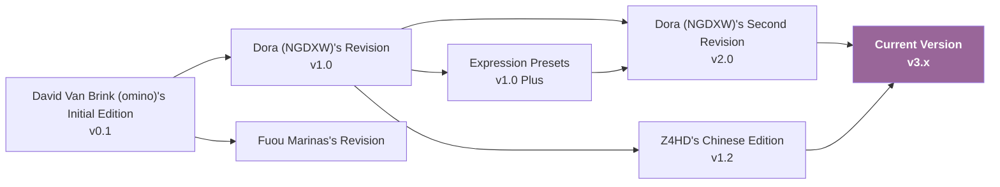

<div lang="en">

[](#om_midi)
<div align="center">
	<h2 id="om_midi">om midi</h2>
	<!-- <p><b><i>Ranne</i></b></p> -->
	<p>
		
		
		
	</p>
	<p><a href="https://github.com/otomad/om_midi/releases/latest"></a></p>

**English** | [简体中文](README_zh-CN.md) | [日本語](README_ja-JP.md) | [Tiếng Việt](README_vi-VN.md) | [한국어](README_ko-KR.md)
</div>

**om midi**, an Otomad/YTPMV assistant script for **After Effects**. It is a script that automatically converts MIDI files to keyframes in After Effects. Hope that with the help of om midi, people can be rescued from tedious aligning video and audio, and put more energy into more creative works.

Thanks to original script creators [@David Van Brink (omino)](https://omino.com/), [@Dora (NGDXW)](https://space.bilibili.com/40208180), [@Z4HD](https://github.com/Z4HD) for their efforts. And this repository is modified based on Z4HD's repository [om_midi_NGDXW_zh](https://github.com/Z4HD/om_midi_NGDXW_zh).

The current project is rewritten using new technologies like TypeScript based on legacy scripts.

**Spelling conventions for "om midi": All lowercase** letters, even at the beginning of a sentence, however can be ignored where the context is all uppercase; words are separated by **spaces** instead of underscores.

**Sister Projects:** [Otomad Helper for Vegas](https://github.com/otomad/OtomadHelper).

**Another branch of om midi:** [ReOm MIDI](https://github.com/FuouM/AE-ReOm-MIDI) — An independent branch based on the initial om midi with a different direction, maintained by [Fuou Marinas](https://github.com/FuouM).

### Translators
* Vietnamese translation provided by [@Cyahega](https://github.com/Cyahega).
* Korean translation provided by @binmode.

### Documentations
* [Z4HD's Chinese Documentation](https://om.z4hd.cf/)
* [My Chinese Release Notes](https://www.bilibili.com/read/cv18532219)

### **Compatibility**
`CS4` and later versions are theoretically supported. And both Windows and macOS are theoretically supported.

### Install
Download the latest script files.

#### `om midi`
Placed in the `Scripts\ScriptUI Panels` folder located in the After Effects installation directory.
> (i.e. C:\Program Files\Adobe\Adobe After Effects 2026\Scripts\ScriptUI Panels)

#### `om utils`
There are two ways to import:
1. Placed in the same directory as the aep project.
	* Prepend to expressions:
```javascript
$.evalFile(thisProject.fullPath.replace(/\\[^\\]*$/, "\\om_utils.jsx"));
```
2. Placed anywhere, and then add to AE project.
	* Prepend to expressions:
```javascript
footage("om_utils.jsx").sourceData;
```

### Tutorial
[](https://youtu.be/amDtqY_HsGM)

#### Especially
If After Effects raises an error as shown when opening the script.

Please enable *Edit > Preferences > Scripting & Expressions > Allow Scripts to Write Files and Access Network*.

### Roadmap
[Go to GitHub Project **OTOMAD+** >](https://github.com/users/otomad/projects/2)

### Versions Comparison
> Except v1.2, no version tags are given for others. So those version tags are defined by myself.

| Ver. | Common Name | Multitrack Support | Add Keyframes to Layers | English UI | Additional Useful Keyframes | Manually Select MIDI Tracks | Change BPM | Dynamic BPM |
| :--- | :--- | :---: | :---: | :---: | :---: | :---: | :---: | :---: |
| v0.1 | [David Van Brink (omino)'s Initial Edition](https://omino.com/pixelblog/2011/12/26/ae-hello-again-midi/) | ✔️ | ❌ | ✔️ | ❌ | ❌ | ❌ | ❌ | ❌ |
| v1.0 | [Dora (NGDXW)'s Revision](https://www.bilibili.com/read/cv170398) | ✔️ | ❌ | ✔️ | ✔️ | ❌ | ❌ | ❌ |
| v1.0 Plus | [Expression Presets](https://www.bilibili.com/video/av29649969) | ✔️ | ✔️ | ✔️ | ✔️ | ❌ | ❌ | ❌ |
| v1.2 | [Z4HD's Chinese Edition](https://github.com/Z4HD/om_midi_NGDXW_zh) | ✔️ | ❌ | ❌ | ✔️ | ❌ | ❌ | ❌ |
| v2.0 | [Dora (NGDXW)'s Second Revision](https://www.bilibili.com/read/cv1217487) | ❌ | ✔️ | ❌ | ✔️ | ❌ | ❌ | ❌ |
| v3.x | **Current Version** | ✔️ | ✔️ | ✔️ | ✔️ | ✔️ | ✔️ | ✔️ |

#### Branch Relationship



### References
#### Previous Versions
* [David Van Brink (omino)'s Initial Edition](https://omino.com/pixelblog/2011/12/26/ae-hello-again-midi/)
* [Dora (NGDXW)'s Revision](https://www.bilibili.com/read/cv170398)
* [Expression Presets](https://www.bilibili.com/video/av29649969)
* [Z4HD's Chinese Edition](https://github.com/Z4HD/om_midi_NGDXW_zh)
* [Dora (NGDXW)'s Second Revision](https://www.bilibili.com/read/cv1217487)
#### Other Branches
* [Fuou Marinas's Revision](https://github.com/FuouM/AE-ReOm-MIDI)
#### Introduction Videos
* [Dragon Ancestor - Dans la rue.aep](https://www.bilibili.com/video/av9228581)
* [Chen Shen Chen - melon style.aep](https://www.bilibili.com/video/av9778499)
#### Dependencies
* [Motion Developer's Rollup TypeScript Scaffolding](https://github.com/motiondeveloper/expression-globals-typescript)
* [TypeScript types for Adobe Products](https://github.com/aenhancers/Types-for-Adobe)
* [Sergi Guzman (colxi)'s midi-parser-js - MIDI File Format Specifications](https://github.com/colxi/midi-parser-js/wiki/MIDI-File-Format-Specifications)

</div>
