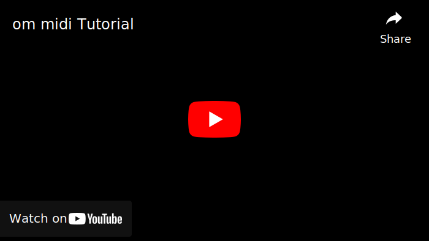

<div lang="ko">

[](#om_midi)
<div align="center">
	<h2 id="om_midi">om midi</h2>
	<p><b>란음</b></p>
	<p><a href="https://github.com/otomad/om_midi/releases/latest"></a></p>

[English](README.md) | [<span lang="zh-CN">简体中文</span>](README_zh-CN.md) | [日本語](README_ja-JP.md) | [Tiếng Việt](README_vi-VN.md) | **한국어**
</div>

**om midi**, **After Effects** 의 소리 MAD / YTPMV 보조 스크립트. 이 스크립트는 MIDI 파일을 After Effects 의 키프레임으로 자동으로 변환하는 스크립트입니다. om midi 의 도움으로 사람들을 무미건조하고 무거운 음화 정렬에서 구하고 더 창의적인 작업에 더 많은 에너지를 쏟을 수 있기를 바랍니다.

스크립트 원작자들 [@David Van Brink (omino)](https://omino.com/), [@도라 (NGDXW)](https://space.bilibili.com/40208180), [@가별대제](https://github.com/Z4HD)의 노력에 감사드립니다. 이 창고는 가별대제의 원시 창고 [om_midi_NGDXW_zh](https://github.com/Z4HD/om_midi_NGDXW_zh) 수정됨.

현재 프로젝트는 이전 버전의 스크립트에 따라 TypeScript 와 같은 새로운 기술을 사용하여 다시 작성됩니다.

**'om midi' 에 대한 맞춤법 규범: 모든** 알파벳 **소문자는** 문장 첫머리에 있을 때도 마찬가지이지만 모든 대문자의 언어 환경에서 이 조항을 무시할 수 있습니다. 단어는 밑줄 대신 **공백으로** 구분됩니다.

**자매 프로젝트:** [Otomad Helper for Vegas](https://github.com/otomad/OtomadHelper).

### 번역자
* 베트남어 번역은 [@Cyahega](https://github.com/Cyahega) 에서 제공합니다.
* 한국어 번역은 @빈모드 에서 제공합니다.

### 설명 문서
* [가별대제의 중국어 문서](https://om.z4hd.cf/)
* [나의 중국어 릴리스 노트](https://www.bilibili.com/read/cv18532219)

### **호환성**
이론적으로 `CS4` 및 이후 버전을 지원합니다. 그리고 이론적으로 Windows 와 macOS 가 모두 지원됩니다.

### 설치
스크립트 파일을 다운로드합니다.

#### `om midi`
After Effects 설치 디렉토리에 있는 `Scripts\ScriptUI Panels` 폴더로 이동합니다.
> (예: C:\Program Files\Adobe\Adobe After Effects 2023\Scripts\ScriptUI Panels)

#### `om utils`
다음과 같은 두 가지 방법으로 가져올 수 있습니다.
1. AEP 프로젝트와 동일한 디렉토리에 배치된 경우.
	* 표현식 앞에 추가
```javascript
$.evalFile(thisProject.fullPath.replace(/\\[^\\]*$/, "\\om_utils.jsx"));
```
2. 아무 곳에나 배치된 후 AE 프로젝트에 추가.
	* 표현식 앞에 추가
```javascript
footage("om_utils.jsx").sourceData;
```

### 자습서
[](https://youtu.be/amDtqY_HsGM)

#### 오빠 조심하세요
After Effects 에서 스크립트를 열 때 그림과 같은 오류가 발생한 경우  
  
*편집 > 기본 설정 > 스크립트 및 표현식 > 스크립트 파일 쓰기 및 네트워크 액세스 허용*.

### Roadmap
[GitHub 프로젝트 **OTOMAD+** 바로가기 >](https://github.com/users/otomad/projects/2)

### 버전 비교
> v1.2 를 제외한 다른 버전은 버전 번호를 제공하지 않습니다. 그래서 그 버전 번호들은 내가 직접 작성한 것이다.

| 버전 | 일반 이름 | 멀티트랙 지원 | 레이어에 키프레임 추가 | 한국어 UI | 추가로 유용한 키프레임 | 수동으로 MIDI 트랙 선택 | BPM 변경 | 동적 BPM |
| :--- | :--- | :---: | :---: | :---: | :---: | :---: | :---: | :---: |
| v0.1 | [David Van Brink(omino)의 오리지널 에디션](https://omino.com/pixelblog/2011/12/26/ae-hello-again-midi/) | ✔️ | ❌ | ❌ | ❌ | ❌ | ❌ | ❌ | ❌ |
| v1.0 | [Dora(NGDXW)의 개정판](https://www.bilibili.com/read/cv170398) | ✔️ | ❌ | ❌ | ✔️ | ❌ | ❌ | ❌ |
| v1.0 윤 | [표현식 사전 설정](https://www.bilibili.com/video/av29649969) | ✔️ | ✔️ | ❌ | ✔️ | ❌ | ❌ | ❌ |
| v1.2 | [가별대제의 중국판](https://github.com/Z4HD/om_midi_NGDXW_zh) | ✔️ | ❌ | ✔️ | ✔️ | ❌ | ❌ | ❌ |
| v2.0 | [Dora(NGDXW)의 두 번째 개정판](https://www.bilibili.com/read/cv1217487) | ❌ | ✔️ | ✔️ | ✔️ | ❌ | ❌ | ❌ |
| v3.x | **현재 버전** | ✔️ | ✔️ | ✔️ | ✔️ | ✔️ | ✔️ | ✔️ |

### 참조
#### 이전 버전
* [David Van Brink(omino)의 오리지널 에디션](https://omino.com/pixelblog/2011/12/26/ae-hello-again-midi/)
* [Dora(NGDXW)의 개정판](https://www.bilibili.com/read/cv170398)
* [표현식 사전 설정](https://www.bilibili.com/video/av29649969)
* [가별대제의 중국판](https://github.com/Z4HD/om_midi_NGDXW_zh)
* [Dora(NGDXW)의 두 번째 개정판](https://www.bilibili.com/read/cv1217487)
#### 소개 동영상
* [용의 조상 - 거리에서.앺](https://www.bilibili.com/video/av9228581)
* [진심신 - 멜론 스타일.앺](https://www.bilibili.com/video/av9778499)
#### 종속성
* [Motion Developer의 Rollup TypeScript 스캐폴딩](https://github.com/motiondeveloper/expression-globals-typescript)
* [Adobe 제품의 TypeScript 유형](https://github.com/aenhancers/Types-for-Adobe)
* [Sergi Guzman(colxi)의 midi-parser-js - MIDI 파일 형식 사양](https://github.com/colxi/midi-parser-js/wiki/MIDI-File-Format-Specifications)

</div>

