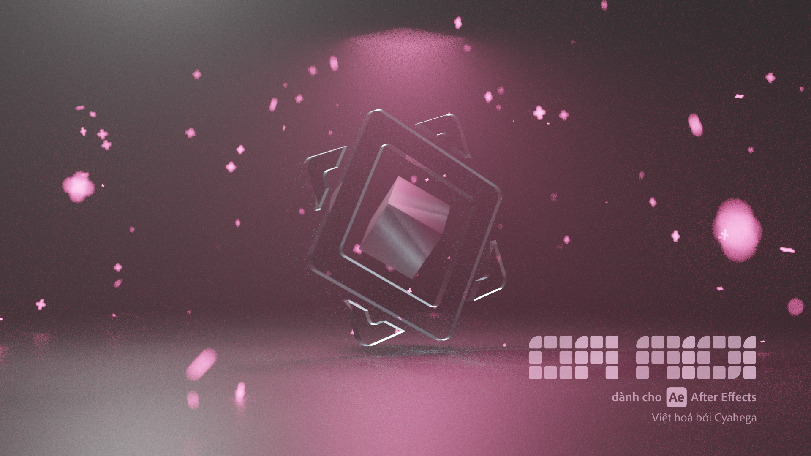
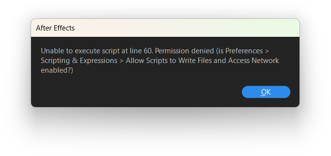

<div lang="vi">

[](#om_midi)
<div align="center">
	<h2 id="om_midi">om midi</h2>
	<p><b><i>Lan Âm</i></b></p>

[English](README.md) | [简体中文](README_zh-CN.md) | [日本語](README_ja-JP.md) | **Tiếng Việt**
</div>

**om midi**, là một script hỗ trợ làm Otomad/YTPMV dành cho **After Effects**. Nó là một script giúp tự động chuyển đổi file MIDI thành keyframe trong After Effects. Hi vọng rằng với sự trợ giúp từ om midi, mọi người sẽ được cứu rỗi khỏi việc căn chỉnh video và âm thanh nhàm chán, và dành nhiều năng lượng hơn vào việc sáng tạo tác phẩm của mình.

Chân thành cảm ơn những người tạo ra script là [@David Van Brink (omino)](https://omino.com/), [@Dora (NGDXW)](https://space.bilibili.com/40208180), [@Z4HD](https://github.com/Z4HD) vì công sức của họ. Và lưu trữ (repository) này được chỉnh sửa dựa trên lưu trữ của Z4HD là [om_midi_NGDXW_zh](https://github.com/Z4HD/om_midi_NGDXW_zh).

Dự án hiện tại được viết lại bằng công nghệ mới như TypeScript dựa trên script kế thừa.

**Quy ước chính tả cho "om midi": Tất cả các chữ thường**, thậm chí ở đầu câu, tuy nhiên có thể bỏ qua khi ngữ cảnh là chữ viết hoa; các từ được phân tách bằng **dấu cách** thay vì dấu gạch dưới.

Phiên bản Việt hoá của script này được thực hiện bởi [**Cyahega**](https://github.com/cyahega).

**Các dự án khác:** [Otomad Helper dành cho Vegas](https://github.com/otomad/OtomadHelper).

### Các tài liệu
* [Tài liệu tiếng Trung của Z4HD](https://om.z4hd.cf/)
* [Ghi chú cập nhật bằng tiếng Trung của tôi](https://www.bilibili.com/read/cv18532219)

### Phiên bản AE được hỗ trợ 
`CS4` và các phiên bản sau này về mặt lý thuyết là được hỗ trợ . Và cả 2 hệ điều hành Windows và macOS về mặt lý thuyết là được hỗ trợ.

### Cài đặt
[**Tải xuống**](https://github.com/otomad/om_midi/releases) file mới nhất của script.

#### `om midi`
Đặt script vào thư mục `Scripts\ScriptUI Panels` nằm trong đường dẫn cài đặt của After Effects.
> (Ví dụ. C:\Program Files\Adobe\Adobe After Effects 2022\Scripts\ScriptUI Panels)

#### `om utils`
Có 2 cách để nhập vào:
1. Đặt vào cùng đường dẫn với .aep project.
	* Thêm vào biểu thức (expression):
```javascript
$.evalFile(thisProject.fullPath.replace(/\\[^\\]*$/, "\\om_utils.jsx"));
```
2. Đặt vào bất cứ đâu, và sau đó thêm vào project AE.
	* Thêm vào biểu thức (expression):
```javascript
footage("om_utils.jsx").sourceData;
```

#### Đặc biệt 
Nếu After Effects hiện lên lỗi như dưới đây khi mở script.  
  
Vui lòng bật *Edit > Preferences > Scripting & Expressions > Allow Scripts to Write Files and Access Network*.

### So sánh các phiên bản
> Ngoại trừ v1.2, không có thẻ phiên bản được ghi rõ cho các phiên bản khác. Vì vậy, các thẻ phiên bản được xác định bởi chính tôi.

| Ver. | Tên thông thường | Hỗ trợ Multitrack | Thêm Keyframes vào Layers | UI tiếng Việt | Keyframes hữu ích bổ sung | Chọn các MIDI Track thủ công | Thay đổi BPM | BPM động |
| :--- | :--- | :---: | :---: | :---: | :---: | :---: | :---: | :---:  |
| v0.1 | [Phiên bản gốc của David Van Brink (omino)](https://omino.com/pixelblog/2011/12/26/ae-hello-again-midi/) | ✔️ | ❌ | ❌ | ❌ | ❌ | ❌ | ❌ |
| v1.0 | [Bản sửa đổi của Dora (NGDXW)](https://www.bilibili.com/read/cv170398) | ✔️ | ❌ | ❌ | ✔️ | ❌ | ❌ | ❌ |
| v1.0 Plus | [Preset biểu thức (Expression)](https://www.bilibili.com/video/av29649969) | ✔️ | ✔️ | ❌ | ✔️ | ❌ | ❌ | ❌ |
| v1.2 | [Phiên bản tiếng Trung của Z4HD](https://github.com/Z4HD/om_midi_NGDXW_zh) | ✔️ | ❌ | ❌ | ✔️ | ❌ | ❌ | ❌ |
| v2.0 | [Bản sửa đổi thứ hai của Dora (NGDXW)](https://www.bilibili.com/read/cv1217487) | ❌ | ✔️ | ❌ | ✔️ | ❌ | ❌ | ❌ |
| v3.x | **Phiên bản hiện tại** | ✔️ | ✔️ | ✔️ | ✔️ | ✔️ | ✔️ | ✔️ |

### Chú thích
#### Các phiên bản trước
* [Phiên bản gốc của David Van Brink (omino)](https://omino.com/pixelblog/2011/12/26/ae-hello-again-midi/)
* [Bản sửa đổi của Dora (NGDXW)](https://www.bilibili.com/read/cv170398)
* [Preset biểu thức (expression)](https://www.bilibili.com/video/av29649969)
* [Phiên bản tiếng Trung của Z4HD](https://github.com/Z4HD/om_midi_NGDXW_zh)
* [Bản sửa đổi thứ hai của Dora (NGDXW)](https://www.bilibili.com/read/cv1217487)
#### Các video giới thiệu
* [Dragon Ancestor - Dans la rue.aep](https://www.bilibili.com/video/av9228581)
* [Chen Shen Chen - melon style.aep](https://www.bilibili.com/video/av9778499)
#### Phụ thuộc vào
* [Rollup TypeScript Scaffolding của Motion Developer](https://github.com/motiondeveloper/expression-globals-typescript)
* Adobe Types của [Silly-V](https://github.com/Silly-V/Adobe-TS-ExtendScript) và [aenhancers](https://github.com/aenhancers/Types-for-Adobe)
* [midi-parser-js của Sergi Guzman (colxi)- Thông số kỹ thuật định dạng tệp MIDI](https://github.com/colxi/midi-parser-js/wiki/MIDI-File-Format-Specifications)
* [mmkr](https://github.com/stysmmaker/mmkr) và [AddMarkersFromJSON](https://github.com/stysmmaker/AddMarkersFromJSON) của MMaker.

</div>
