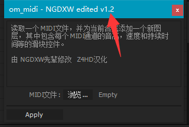

# 下载

!!! note

    如无特殊说明，本中文文档仅针对 `om_midi_NGDXW_zh.jsx` v1.2 及其后续版本。

!!! note "版本支持"

    理论上支持 `CS5` 及以后的版本，笔者已在 CC 2015.3 上测试，各项功能一切正常。

- [原版](http://omino.com/pixelblog/2011/12/26/ae-hello-again-midi/)：[om_midi.jsx](http://omino.com/pixelblog/wp-content/uploads/2011/12/om_midi.jsx)
- [NGDXW先辈修改版](https://www.bilibili.com/read/cv170398)：[om_midi_NGDXW.jsx](http://download.doraemon.moe/om_midi.jsx)
- 汉化版：[om_midi_NGDXW_zh.jsx](https://github.com/Z4HD/om_midi_NGDXW_zh/raw/master/om_midi_NGDXW_zh.jsx)

## 版本对比

版本 | 多轨支持 | 添加关键帧至图层 | 中文UI | 额外的实用关键帧
-|:-:|:-:|:-:|:-:
[原版](http://omino.com/pixelblog/2011/12/26/ae-hello-again-midi/) | ✔ | ❌ | ❌ | ❌
[NGDXW先辈修改版](https://www.bilibili.com/read/cv170398) | ✔ | ❌ | ❌ | ✔
[om_midi_NGDXW_zh.jsx](https://github.com/Z4HD/om_midi_NGDXW_zh/raw/master/om_midi_NGDXW_zh.jsx) | ✔ | ❌ | ✔  | ✔
[NGDXW再次修改版](https://www.bilibili.com/read/cv1217487) | ❌ | ✔ | ✔  | ✔

## 安装

下载脚本文件并将其移动至位于 AfterEffects 安装目录的 `Script` 或 `Script\ScriptUI` 文件夹中。

!!! note "AE 的安装目录在哪？"
    也许谷歌搜索一番可以得到更好的答案。下面是一些示例，实际情况可能因AE版本不同或安装设置不同而有区别：
    Windows：`C:\Program Files\Adobe\Adobe After Effects CC 2015.3\`

## 启动

### 脚本位于 `Script` 文件夹中

文件 -> 脚本 -> `om_midi_NGDXW_zh.jsx`

### 脚本位于 `Script\ScriptUI` 文件夹中

窗口 -> `om_midi_NGDXW_zh.jsx`

## 检查脚本版本

脚本文件头部的 `RELEASE_VERSION` 变量提供了脚本的发布版本。

脚本窗口的标题栏上也会有体现，但脚本位于 `Script\ScriptUI` 文件夹时可能不可见。

