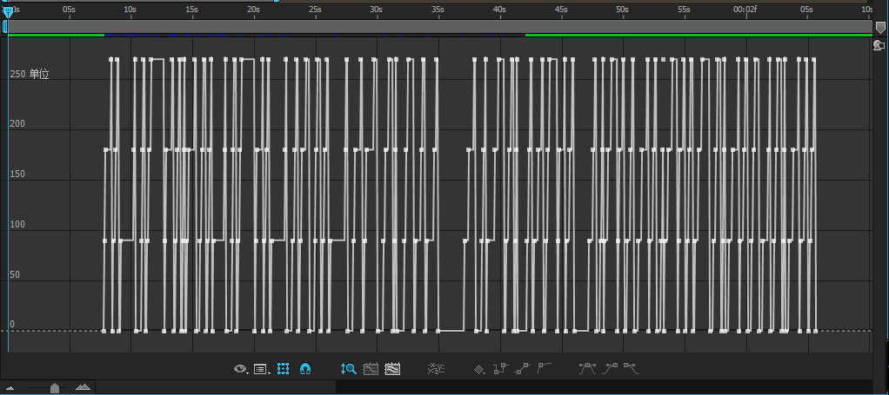
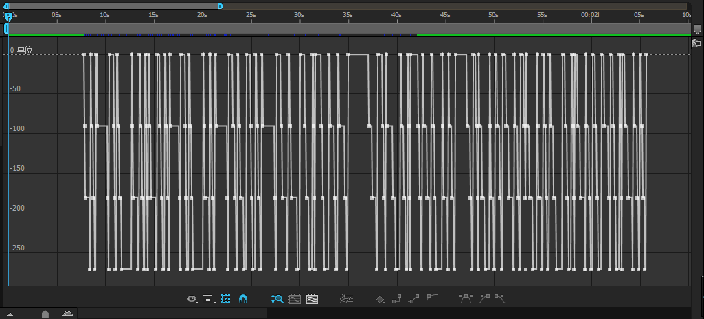
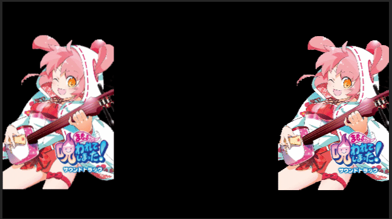

# 顺时针/逆时针旋转

!!! note "版本信息"
    该特性包含于 NGDXW先辈 修改版 om_midi

每有一个音符，关键帧的值均为 `0` -> `90` -> `180` -> `270` -> `0` ...... 以此类推。

!!! note
    逆时针：`0` -> `-90` -> `-180` -> `-270`

## 预览

如果直接用表达式关联器将 _滑块_ 效果与 _缩放_ 效果关联的话，效果大概跟下面这个GIF差不多。

